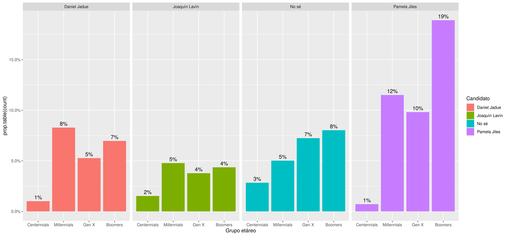
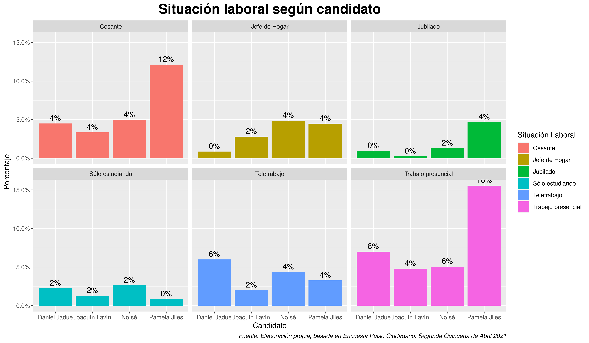
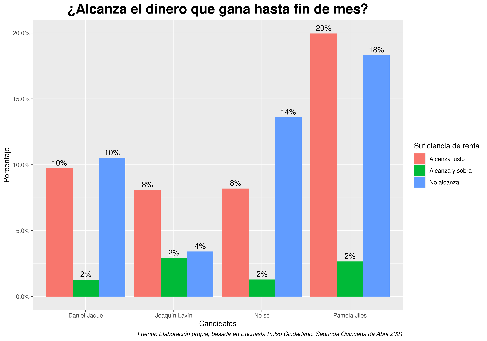
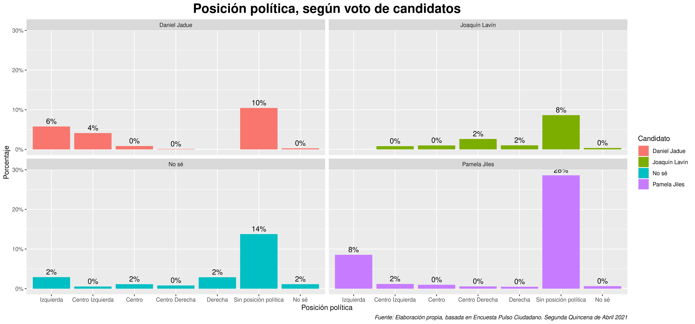
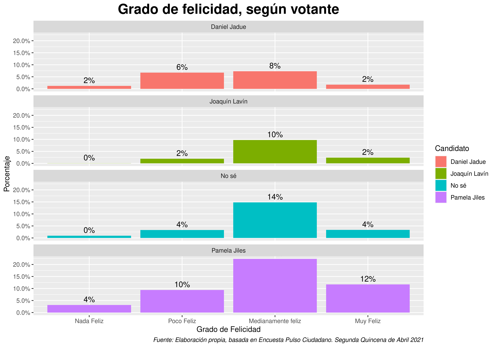

<style>
body {
text-align: justify}
</style>

```{r setup, include=FALSE}
knitr::opts_chunk$set(echo = TRUE)
knitr::opts_knit$set(root.dir = rprojroot::find_rstudio_root_file())
```

# **Introducción** 

Este informe pretende ahondar más detalladamente en los elementos centrales que ha dado la última encuesta de ActivaResearch llamada _"Pulso Ciudadano"_. A diferencia de otras encuestas de estudios de mercado, es inédito que por primera vez una consultora privada haya liberado su base de datos, y que en contexto donde las encuestadoras más prestigiosas como la CEP no han realizado sistemáticamente investigaciones -y las que han hecho resultan bastante mediocres- esta base de datos es un insumo bastante fiable para un análisis de opinión pública lo más acotado posible. El informe hecho por activa research pueden encontrarlo en este [link](https://chile.activasite.com/wp-content/uploads/2021/05/Pulso_Ciudadano_ABRIL_Q2.pdf), y la base de datos pueden encontrarla en el siguiente [link](https://chile.activasite.com/wp-content/uploads/2021/05/BBDD_Pulso-Abril-Q2_.zip). El material de replicación de este estudio puedes encontrarlo [en este link](https://github.com/francisco-vr/Pulso_Ciudadano).

En lo que respecta a las características metodológicas de levantamiento de información, estas están mejor explicadas en el informe original de la encuesta Pulso Ciudadano y para quienes estén interesados en revisarlas, sugerimos ver el informe original. En términos de análisis de datos, se puntualiza lo siguiente: de los 1184 casos validados en la base de datos original, se filtró a partir de la preferencia electoral de los tres candidatos más competitivos: Pamela Jiles, Daniel Jadue y Joaquín Lavín. Además, se agregó un grupo llamado "indecisos" que son las personas que en la pregunta sobre cuál candidato prefieren para próximo presidente señalaron "no sé". Todos los demás candidatos poco competitivos, así como otras menciones espontáneas y quienes señalan "no sabe/no responde" fueron eliminados, reduciendo la muestra a 532 casos válidos, los cuales fueron ponderados a partir de la variable "PONDERADOR" proporcionada por la encuestadora y explicada en su reporte.

La intención de este informe es doble: por un lado entender cuáles son las características y posición política de quienes votan por la diputada Pamela Jiles, a fin de entender a qué tipo de público electoral apunta, y por otro lado entender cuáles son las características de un cuarto grupo, que son los indecisos de votación. El supuesto detrás de esta investigación es que **las características sociales, económicas y políticas de los votantes de cualquiera de los tres candidates que se asemeje al grupo indeciso, tiene más chanches de ir acaparando esos votos**. No tenemos pruebas _pero tampoco dudas_.

## **Características socioeconómicas de cada uno de los grupos de votantes**

Parte de los elementos esenciales del análisis de los electores son las características sociodemográficas como nivel socioeconómico, sexo, grupo etáreno y nivel educacional. A pesar de que la encuesta no integra una pregunta de este último ámbito, si tenemos los primeros tres. veamos los resultados de cada una de las tablas, desagregadas por candidato.


```{r, echo=FALSE, message=FALSE, warning=FALSE}
library("haven")
library("dplyr")
library("tidyverse")
library("summarytools")
library("kableExtra")
```

```{r, carga-base, echo=FALSE}
tablas <-readRDS("Results/tablas.rds")
voto <-readRDS("~/Documentos/Git/Pulso Ciudadano/Pulso_Ciudadano/Original Data/Pulso_Ciudadano.rds")

```

### **Nivel Socioeconómico**

La extracción de clase es un pilar para el entendimiento de los votantes de cada uno de los candidatos y, por sobre todo, para conocer el universo de personas que aún "no saben" por quien votar. Dado el contexto de crisis económica, sanitaria, política y social, la clase vuelve a ser uno de los elementos más determinantes a la hora de la identidad y de la relación candidato-votante. 

Observemos los resultados de esta tabla cruzada:

```{r tablaGSE, echo=FALSE, message=TRUE,warning=FALSE,results='asis'}
tablas[[2]]

```

Esta tabla y las siguientes están diseñadas para ser leídas a partir de la distribución porcentual desagregada _dentro_ del total por cada candidato. Vemos que porcentualmente todos los candidatos (e incluso el grupo de personas que no saben por quien votar) se concentran en el nivel socioeconómico D, siendo Joaquín Lavín el de porcentaje más atenuado en ese sector. Por otra parte, los que sobresalen en esa distirbución son Daniel jadue con 52,3% de sus votantes ubicados en ese sector, pero sobre todo Pamela Jiles con casi un 67% de votantes del estrato D. 

Por otro lado, es interesante puntualizar que en términos socioeconómicos, Tanto Pamela Jiles como Daniel jadue concentran un 87% y un 74% de sus votantes respectivamente, en los estratos C3 y D. Joaquín Lavín queda claramente como un candidato de la élite teniendo no despreciables 11,7% en el sector C1 y 29% en el sector C2. Bastante más pituco.

Observemos ahora el gráfico que calcula el 100% desde el total de la muestra:

\newline
\newline


Además de observar que tanto jiles y Jadue concentran el 40% de los votantes que además corresponden a las clases bajas como el sector D, es interesante observar un grupo que es el de los que aún no sabe por quien votar. Queda todavía una gran cantidad de personas de clase baja que aún no se deciden (probablemente más jóvenes, donde menos ayudas económicas han llegado) pero sobre todo hay una población dura de la clase más baja en Chile que aún no sabe por quien votará. Este último sector, el de los más pobres, prácticamente no está presente en ninguno de los candidatos competitivos, salvo Pamela Jiles que tiene un 2% del total. Numerosos estudios pŕevios han mostrado el poco interés de los pobres en las elecciones, principalmente por una sensación (bastante certera) de que sus condiciones de vida no cambiarán mucho si van a votar, sin embargo desde el punto de vista de las elecciones, es clave para cualquiera de estos candidatos acercarse más a ese sector y a los que restan de clases más bajas.


### **Sexo**

Desde ya un lustro el feminismo y las luchas por la destrucción del patriarcado transformaron la política actual, y las candidaturas no son la excepción. Desde el Frente Amplio y la Concertación han hecho una importante cantidad de críticas hacia Daniel jadue por "Machista" y "Misógino", así como Gabriel Boric hace alardes en las noticias de estar tomando clases de Feminismo. Más allá de su veracidad, es un _frame_ que se quiere instalar ya que pretenden posicionar al partido del orden y a sus grupos progresistas afines como _la opción_ de las mujeres.

Por esto se hace necesario revisar cómo es la distribución por sexo de cada uno de los candidatos y observar qué diferencias existen. 

\newline


```{r tablasexo, echo=FALSE, message=TRUE,warning=FALSE,results='asis'}

tablas[[3]]

```

En esta tabla hay tres cosas principales a destacar. Primero: Tanto Daniel Jadue como Pamela Jiles tienen un alto nivel de masculinización de su voto; esto podría tener una gran cantidad de explicaciones, entre ellas los atributos personales de ambos, pero probablemente también por las características de los "hombres proveedores" que, a partir de una distribución el patricarcado en términos laborales, son ellos los que más dinero tienen en la AFP y salen a trabajar no-domésticamente para dar sustentos en sus familias. Por otro lado Joaquín lavín está muy equilibrado en temas de sexo.

Donde hay elementos más interesantes son en el grupo que no sabe por quien votar: Hay una notable cantidad de mujeres aún indecisas, que no saben por quien van a votar y que, a juzgar por las características de los candidatos que son más competentes, no son precisamente feministas ni necesariamente han tomado esa bandera, nisiquiera cercana a políticas públicas centradas en las mujeres.

Probablemente la apuesta de algunos candidatos progresistas del Frente Amplio y la Concertación se estarán centrando en ese grupo de mujeres aún indecisas, pero por lo visto sólo han fracasado. 


como podemos apreciar en el gráfico que toma cada etiqueta de candidato como una parte del 100% de la muestra, vemos que los hombres tienen un gran nivel de decisión de su voto, y viéndolo en perspectiva, el grupo de indecisos están equilibrados en género, por lo que aún queda mucho por ir a convencer para votación.


### **Grupo Etáreo**

Ahora ¿a quienes llegan más los candidatos en términos de edad? Los grupos generacionales son bastante relevantes y ampliamente estudiados en sus diversas formas de socialización política, tienen miedos y emociones diferentes, se atreven a distintas cosas y, por sobre todo, tienen una conducta electoral diferente.

En la siguiente tabla cruzada observaremos cómo los grupos etáreos se distribuyen en cada una de las candidaturas:

\newline

```{r tablaEdad, echo=FALSE, message=TRUE,warning=FALSE,results='asis'}
tablas[[1]]
```

A pesar de que Pamela Jiles haya hecho una de sus performances como Naruto (y muy mal interpretadas por un Diputado de derecha), uno pensaría que ella es por lejos una de las personas que debería tener cautivos a la gente joven, pero la verdad es que Jiles pareciera tener _nulo interés por los grupos más jóvenes_; en otras palabras, jiles es un eminente fenómeno para personas mayores, con casi la mitad de su votación, y que claramente esto se debe a los procesos de retiros de fondos de las AFP, del cual casi lleva un año. Esto en términos electorales es muy relevante pues se sabe que a mayor edad hay una mayor responsabilidad cívica en ir a votar, por lo que apelar a la gente de mayor edad se produce rapidamente en aumento de preferencia.

Por otro lado Daniel Jadue tiene un muy notable arraigo en generaciones adulto jóvenes y adultas, sobre todo Gen X (36 -51 años) y Millenials (22 -35 años); es probable que en este ámbito haya una amplia correlación con niveles educativos más altos, dado el carácter doctrinario/ideológico que implica Jadue, pero esto quedará en pura especulación ya que esas preguntas no fueron realizadas. 

Por otro lado joaquín Lavin pareciera ser relativamente homogéneo, pero llama la atención que el sector de centenialls (18 a 21 años, para efectos de la encuesta) es más alto que en los otros candidatos.

Para hablar del último grupo de los que aún no saben, observemos un poco más el gráfico con la totalidad:

\newline


\newline

Podemos señalar que existe aún un "bolsón de votantes" aún indecisos marcados polarmente por las edades: los _Boomers_ (más de 52 años) con un 8% del total de indecisos, y los _Centenialls_ (18 a 21 años) con un 7% de posibles votantes. Sugeriría ponerle atención a estos grupos y y adoptar mecanismos y políticas publicas enfocadas en ellos, sobre todo porque las ayudas económicas y fenómenos como la educación sólo han sabido de humillación para estos sectores, incluídos además la exclusión del proceso constituyente de los más jóvenes.

\newline

## **Situación económica de quienes votan**

Similar a lo que implica la estratificación social y económica según los votantes, actualmente la situación laboral y el dinero que ganan es un argumento cada vez más poderoso, que puede condicionar la conducta electoral en el país, sobre todo con los niveles de pobreza actual. Esta misma encuesta Pulso Ciudadano ubica, según GSE, los niveles de cesantía entre 33% (en el caso de los sectores D y E) hasta el 12% de cesantía en el sector C1. 

Analicemos, pues, los datos que dan tanto la tabla como el gráfico.

```{r tablaLabo, echo=FALSE, message=TRUE,warning=FALSE,results='asis'}

tablas[[4]]

```



Analistas políticos/electorales de derecha como Gonzalo Müller adscriben a la tesis de que el fenómeno de Pamela Jiles es más bien un fenómeno de clases medias y no de sus _Sin Monea_, sin embargo considerando los GSE y esta información, vemos que son más bien un fenómeno de _trabajadores pobres_: gente que trabaja y/o teletrabaja pero que se mantiene en sectores muy bajos, además de casi un 30% de personas cesantes que votan por ella, el porcentaje más alto de cualquiera de los otros candidatos. En resumen, Müller se equivoca rotundamente.

Por otro lado, Daniel Jadue tiene una distribución que considero "sorpresiva": Una alta cantidad de estudiantes que votarían eventualmente por él (ahí relaciona el nivel educacional del cuál hablaba anteriormente), una porción no menor de cesantes aunque a 10 puntos porcentuales de Jiles; finalmente, más de la mitad de sus votantes se encuentran trabajando y teletrabajando.

Finalmente, sería interesante hipotetizar las diferencias entre teletrabajo v/s trabajo presencial. ¿Significará el trabajo presencial trabajo precarizado? Si es así, Jiles tiene una cantidad importante de votantes de este tipo, haciendo un paralelo entre los "pobres sin educación v/s los pobres ilustrados".

```{r tablaMoni, echo=FALSE, message=TRUE,warning=FALSE,results='asis'}

tablas[[5]]

```

Veamos los totales por todos los candidatos:


Lo que se puede decir de esta tabla y gráfico, y es algo que resaltaremos después en términos electorales, es que los tipos de votantes de Pamela Jiles y Daniel jadue en este ámbito exhiben una gran similitud. En ambas candidaturas están con muy similares porcentajes la cantidad de personas que llegan "justo" con el dinero a fin de mes, así como personas que sencillamente no alcanzan con el dinero que ganan, lo que se relaciona con lo que anteriormente se señalaba de los sectores de _trabajadores pobres_


## **Posición política**

La posición política de las personas que apoyan a ciertos candidatos podría ser un tema baladí en otros períodos de la historia, pero hoy sobre todo especialmente necesario observar de qué manera se identifican políticamente las personas para ver hacia qué sectores el candidato puede crecer, con quienes pueden hacer alianzas y cómo es percibido por la población que no posee dicha ideología.

\newline

```{r tablaPosPol, echo=FALSE, message=TRUE,warning=FALSE,results='asis'}

tablas[[6]]

```


Una revisión al gráfico con los totales noes muestra esto:


Uno de los mitos que se han estado instalando en la prensa (cadem por medio) y en parte de sectores de la concertación es que Pamela Jiles estaría atrayendo un sector importante de votos de derecha. Según nuestra investigación esto no es así, y de hecho sus nichos de identificación política de sus votantes es bastante clara: casi un 70% de personas sin identificación política clase, y un 20% de votantes que se declaran de izquierda. El otro 10% repartido en las otras cuatro tendencias donde no hay mucho másque rescatar.

Es interesante esto pues Daniel Jadue, en términos del espectro ideológico de sus votantes, pareciera ser más conciliador que la propia Jiles, a pesar del anticomunismo construído de hace décadas en el país. Vemos que dentro de sus votantes hay casi un 27% de personas que se declaran de izquierda, y casi un 20% de personas de centro izquierda que votan por él, cuestión inexistente en Jiles. Como contraparte vemos que jadue llega menos a sectores no identificados ideológicamente, sin embargo sigue siendo muy alto y rodea el 50%. Es un candidato ideológicamente claro al igual que una porción importante de sus votantes.

En el caso de Joaquín lavín es similar a Jiles pero hacia la derecha: casi un 60% de sus votantes declara no tener ideología política definida, mientras un 18,2% se declara de "centro derecha" y un 7% de "derecha", porcentaje similar a los que votan por Lavín y se declaran "de centro". Esta ha sido una de las obsesiones del candidato de la derecha, con el supuesto de que el centro político hace llegar a más personas, sin embargo los que más hacen llegar a sectores no ideológicos es quienes no se sienten parte de este eje izquierda-derecha.

En resumen, Jiles es la que más independientes tiene, a diferencia de las tesis concertacionistas y de Gamba, no roba muchos votos a la derecha. Por último, Jadue es menos polarizante que Jiles


```{r tablaParti, echo=FALSE, message=TRUE,warning=FALSE,results='asis'}

tablas[[7]]

```

Una vista al gráfico nos señala que:


Esta tendencia se confirma en esta pregunta, la cuál está diseñada para señalar que uno es independiente en desmedro a decir que es opositor a Piñera. En este sentido Jiles es la que más personas "independientes" atrae, y Jadue es su absoluto opuesto, siendo una gran cantidad de sus votantes decididos opositores al Gobierno de Piñera.


### **Niveles de felicidad**

¿Por qué es importante la felicidad? No importa por sí mjisma, pero los efectos que tienen las emociones en el comportamiento político son muy relevantes en la discusión y socialización política, en la forma de tomar decisiones, en la información a la que yo me expongo (y cuáles evado) y qué acciones políticas tomaría en el futuro. La felicidad es una emoción que envía mensajes a las personas de que lo que están haciendo es correcto, e invita a repetir y profundizar esa sensación de entusiasmo en las actividades que realizan.

Lamentablemente esta encuesta sólo pregunta por niveles de felicidad habiendo otras emociones relevantes como la ira o el miedo, pero es una aproximación y hay que tomarla como tal.

Analicemos, pues, el siguiente gráfico:


Este gráfico en principio podría parecer algo contradictorio en algunos de sus resultados. Primero, los votantes por Pamela Jiles se reparten principalmente entre Muy felices y medianamente felices, pero quizás el único gran elemento que vale la pena analizar son los niveles de "poco feliz" y "nada feliz", pues indica que hay otras emociones que pueden estar con niveles de preponderancia mayores, como enojo, miedo, desesperanza, ansiedad, etc.

De manera unánime, quien lleva las banderas de la poca felicidad son los votantes de Pamela Jiles, quienes acumulan un 8% aproximado entre "nada feliz" y "poco feliz". Se sabe que candidatas radicales que vienen dsde fuera de loss sistemas políticos explotan emociones como la ira para generar reputación y empatía con la ciudadanía. Por otro lado Daniel Jadue es el siguiente que explota esas características, sobre todo por una tendencia discutsiva antipiñerista que toca teclas similares a las de Jiles.

\newline

## **Conclusiones y recomendaciones**

Las palabras finales las dividiremos en tres partes: Perfiles sociales mayoritarios de cada uno de los candidatos, "bolsones de votos" disponibles según el grupo de indecisos, y por último recomendaciones a Pamela Jiles y Daniel jadue, ya que son los dos candidatos por los cuales el autor de este artículo podría eventualmente adscribir.

### Perfiles de candidatos

* **Pamela Jiles**: Candidata principal de los Hombres, pobres (Cesantes o trabajadores precarizados), principalmente de grupos etáreos sobre 40 años en adelante, sobre todo jubilados y mayores de 52 años´, sin adscripciones ideológicas tan definidas pero aliada además de la izquierda y de los detractores de Piñera. Altamente polarizante para efectos de posibles alianzas.

* **Daniel Jadue**: Candidato presidencial de los Hombres, trabajadores (De alto nivel como trabajadores precarizados), con gran fuerza entre rangos etáreos entre 25 a 50 años, con alta definición política con la izquierda y la centro izquierda. Más posibilidad conciliadora para alianzas con la centro-izquierda en el caso de primarias, pero más débil que sus contrincantes para salir más allá de donde ha llegado.

* **Joaquín lavín**: Candidato presidencial tanto de hombres como mujeres, principalmente trabajadores de buena situación económica y de las élites, de rango etáreo diverso, con una definición política laxa que se traslada al centro político y también a sectores considerados independientes. Es probablemente de los candidatos con más amplitud para llegar a lugares donde originalmente no llegaba, lo que le facilitaría en caso de primarias.


### Bolsos de votos disponibles

Observamos dos grandes bolsones de votos disponibles de personas indecisas, asumiento que los indecisos son aún más y tienen un caracter transversal en GSE, sexo, educación, etc. Sin embargo, los bolsones de votos se centran primero en sectores jóvenes o _Centennialls_, los cuales no tienen ningún referente fuerte del cual poder anclarse. Otro grupo sumamente abandonado expresado en los resultados de este informe pero también en un análisis político más teórico son las mujeres. Las personas que han querido llevar las banderas del feminismo son candidatos que nisiquiera son competitivos, por lo que nisiquiera son motivo de análisis. De todas formas, se hace necesario hacer la diferencia entre "electorado feminista" y "Electrorado mujeres", cuestión que reviste matices comunicacionales y políticos.

Estos dos grupos pueden dar la victoria definitiva a cualquiera de estos tres candidatos, o el surgimiento de un cuarto candidato/a igual de competitivo.

### Recomendaciones

Una recomendación general: **Ya no hay votos ideológicos disponibles. salvo en la izquierda (2%), casi todos ya están definidos. Sólo los independientes ideológicamente marcarán diferencias**.

Para Pamela Jiles:

* <ins>Agenda feminista</ins> Si quiere terminar de dar el batacazo, es necesario que Jiles adopte una agenda feminista o al menos de políticas hacia las mujeres más fuertes que la mera performance. esto ayudaría además a aumentar su densidad política.

* <ins>Políticas para jóvenes</ins> El excesivo énfasis a los retiros del 10% ha dado grandes frutos a la candidata, pero ha olvidado a los jóvenes donde tiene muy buena facilidad de llegar, pero no ha dado al clavo para cautizarla. Es necesario ofrecerles algo para poder conquistarlos, ya que son el grupo etáreo más difícil de convencer para conseguir su lealtad.

* <ins>Conciliar</ins> Jiles tiene la gran ventaja de ser una demoledora del sistema político, juega con la imagen de la mujer malvada y masculinizada que arrasa con todo. Sin embargo esto podría ser matizado algunas veces para no polarizar a sus votantes y poder llegar más lejos. Una buena opción sería adoptar la ley de retiro universal y usarla como ocasión de conciliación, con un trabajo comunicacional fuerte donde muestre a sus _nietitos_ que los hace por ellos y no por cocinas. Una mera firma bastaría.


Para Daniel Jadue:

* <ins>Desideologización</ins> El problema principal de Jadue es que a veces se vuelve esclavo tanto de su ideología como de su partido, y cada vez que es preguntado o presionado en ese sentido responde de manera agresiva ante tal problema, y que se ve fielmente reflejado en este estudio. Daniel Jadue ya no tiene donde más llegar ideológicamente, por lo tanto debe apostar a llegar al público más desideologizado, a quienes no les importan los partidos que, como se ha visto, son la mayoría. Su mejor jugada sería por lejos no ser parte del Partido Comunista, pero es un alero imposible de desembarazarse por cuestiones ideológicas y también prácticas.

* <ins>Políticas sobre la mujer </ins> Jadue constantemente ha sido atacado por "machista" o "misógino", y más allá de que fuese verdad o mentira, el frame se instala de todas formas. Sería recomentable un trabajo en ese sentido, tanto personal como a nivel de política pública. Una ventaja es que cuenta con mujeres comunistas muy poderosas en ese sentido como Camila Vallejos y Karol Cariola, de las cuales debería apoyarse en estos aspectos. No debe ser el machito alfa en todas las ocasiones.

* <ins>Seguir explotando la apelación a la juventud</ins> Daniel Jadue tiene una buena llegada con generaciones de mediana edad hacia abajo, mejores que las de Jiles, y tiene chances de seguir mejorando. acompañada de las dos sugerencias anteriores, se debería diseñar una buena campaña en redes sociales para jóvenes no-universitarios. Es un grupo relevante en cantidad pero difícil en votación.


Y por último, para ambos candidatos: **Habiendo análizado la composición de los votantes que los prefieren a Uds, y sólo visto desde esa dimensión, sus votante son tan homologables que bien podría hacerse una primaria entre ambos. **
